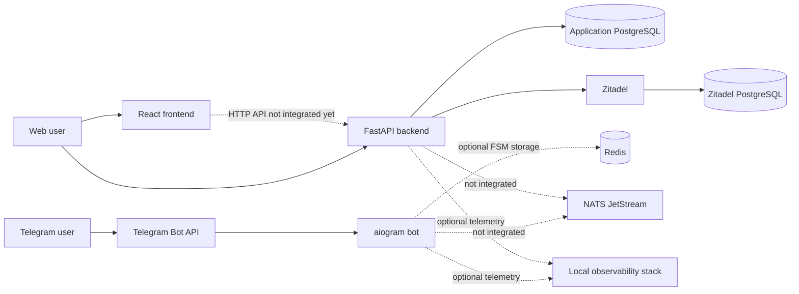

# Architecture

This document describes the architecture that exists in the repository today and the direction the codebase is moving
toward. It is not a claim that every planned product capability has been implemented.

When this document conflicts with executable code, dependency manifests, migrations, or deployment configuration, the
executable artifacts are the source of truth. Product intent and terminology live under [`arch/product`](arch/product/).

## System Summary

DatingBot is a modular monorepo with three independently managed applications:

- [`backend`](backend/) — a Python 3.13 FastAPI application. Authentication and identity linking are the only
  substantial product capabilities currently implemented.
- [`tgbot`](tgbot/) — a Python 3.13 aiogram application that can consume Telegram updates through polling or a FastAPI
  webhook.
- [`front`](front/) — a React and TypeScript single-page application built with Vite and served by Nginx in a container.
  It is currently the Vite starter and is not integrated with the backend.

The applications share repository-level quality gates and local infrastructure, but they do not share a runtime or a
common source package. Dependencies are installed separately for each application.

## Runtime Context

The diagram shows available runtime relationships. Dashed edges are optional, planned, or provisioned without an active
application flow.



## Repository Layout

| Path                              | Responsibility                                                                                                      |
|-----------------------------------|---------------------------------------------------------------------------------------------------------------------|
| [`backend/src`](backend/src/)     | FastAPI entry point, REST presentation, application modules, persistence, identity adapters, logging, and telemetry |
| [`backend/tests`](backend/tests/) | Backend test and PostgreSQL fixture scaffolding                                                                     |
| [`tgbot/src`](tgbot/src/)         | Telegram entry points, handlers, middleware, integrations, configuration, and webhook transport                     |
| [`tgbot/tests`](tgbot/tests/)     | Telegram webhook contract tests and a reserved package for credentialed end-to-end scenarios                        |
| [`front/src`](front/src/)         | React application source                                                                                            |
| [`deploy/local`](deploy/local/)   | Local Docker Compose topology                                                                                       |
| [`monitoring`](monitoring/)       | Grafana, Prometheus, OpenTelemetry Collector, Tempo, Loki, Promtail, and cAdvisor configuration                     |
| [`arch/product`](arch/product/)   | Product vision, philosophy, principles, research, and ubiquitous language                                           |
| [`arch/adr`](arch/adr/)           | Reserved location for architecture decision records                                                                 |
| [`arch/specs`](arch/specs/)       | Reserved location for feature and interface specifications                                                          |
| [`arch/runbooks`](arch/runbooks/) | Reserved location for operational procedures                                                                        |

## Architectural Style

The repository is evolving from a Telegram-only application into a multi-surface product. The intended shape is a
modular backend with multiple presentation surfaces rather than shared business logic embedded in controllers or bot
handlers.

For backend work, the intended dependency direction is:

```text
presentation -> application/domain interfaces <- infrastructure adapters
```

The composition root may depend on every layer to connect adapters to interfaces. Infrastructure code must not become a
shortcut through which presentation code bypasses the application module.

This direction is aspirational in parts of the current auth implementation: `AuthService` imports concrete repository
and identity-verifier classes from `infra` rather than depending on application-owned protocols. That seam should be
deepened when a second adapter or focused test double is introduced; adding interfaces with only one implementation
would create indirection without leverage.

Coding rules for preserving these seams are maintained in [`AGENTS.md`](AGENTS.md#backend-work). This document owns the
shape and current state of the system; `AGENTS.md` owns instructions for changing it.

## Backend

### Entry Point and Request Pipeline

[`backend/src/main.py`](backend/src/main.py) creates the FastAPI application. The setup sequence is:

1. Configure structured logging.
2. Create the FastAPI application and lifespan.
3. Install request logging and optional Prometheus middleware.
4. Register exception handlers and REST routes.
5. Create the Dishka container and bind it to FastAPI.
6. Optionally configure OpenTelemetry tracing.

All public application routes are currently under `/api/v1`. Swagger UI is mounted at `/`.

[`backend/src/presentation/rest`](backend/src/presentation/rest/) owns the HTTP interface:

- `controllers` define routes and status codes;
- `dto` defines Pydantic request and response contracts;
- `middlewares` owns HTTP logging and Prometheus metrics;
- `main.py` composes routes, middleware, error mapping, dependency injection, and tracing.

Domain and authentication failures are translated to HTTP responses in the presentation layer. Unexpected exceptions
are logged and returned as a generic HTTP 500 response.

### Authentication Module

[`backend/src/module/auth`](backend/src/module/auth/) is the only implemented backend product module. It supports:

- constructing a Zitadel authorization URL;
- exchanging a Zitadel authorization code for tokens;
- verifying a Zitadel or Casdoor OIDC access token;
- verifying a Telegram Login Widget payload;
- creating or finding the local user attached to a verified identity;
- listing, linking, and unlinking login identities;
- rejecting suspended or banned users.

The main execution path is:

```text
REST controller
  -> AuthService
    -> TelegramAuthVerifier or OidcTokenVerifier
    -> AuthRepository
      -> PostgreSQL
```

Zitadel and Telegram establish external identity. The backend maps the verified provider subject to its own stable user
ID; provider identity is not used as the product's primary user identifier.

The protected `/me` and identity-management routes request an `AuthenticatedUser` from Dishka. A provider that extracts
and verifies the bearer token is not currently registered, so this part of the HTTP interface is incomplete.

### Persistence

The backend uses async SQLAlchemy with psycopg and PostgreSQL. Alembic owns schema evolution.

The current migration creates two tables:

- `auth_users` — local user ID, account status, and timestamps;
- `auth_identities` — provider, provider subject, optional username and email, timestamps, and a foreign key to the
  local
  user.

The `(provider, subject)` pair is unique, and deleting a user cascades to linked identities. No profile, recommendation,
match, conversation, billing, or notification schema exists yet.

Dishka creates one `AsyncSession` per request. A `UnitOfWork` protocol and SQLAlchemy adapter exist, but the auth
repository currently commits directly. Before a use case spans multiple repositories or writes, transaction ownership
should move to the application operation through the unit-of-work seam.

### Planned Module Names

The repository contains empty package placeholders for `users`, `matching`, `ugc`, `notification`, `support`, `billing`,
and `advert`. These names indicate possible module seams only. They do not define implemented interfaces, data
ownership,
or approved product scope. New behavior still requires a specification and, where relevant, an ADR.

## Telegram Bot

The Telegram application uses aiogram 3 and exposes two mutually exclusive update-consumption modes:

- [`run_polling.py`](tgbot/src/run_polling.py) starts long polling and is the container default;
- [`run_webhook.py`](tgbot/src/run_webhook.py) starts a FastAPI application with `GET /health` and `POST /webhook`.

Both modes create the same aiogram `Bot` and `Dispatcher`, register the same routers and middleware, notify configured
administrators on startup, and close the bot session on shutdown. The webhook validates
`X-Telegram-Bot-Api-Secret-Token` when a secret is configured before feeding the update to aiogram.

Current user-facing behavior is limited to an echo/fallback handler. Several middleware and integration modules remain
from the earlier Telegram application, but their presence does not mean they participate in the active flow.

FSM state uses in-memory storage by default. Redis storage is implemented as an option, but `load_config()` currently
does not construct `RedisConfig`; enabling `USE_REDIS` therefore fails fast instead of silently falling back. Database
configuration is also present but not loaded, and the bot has no active persistence path.

Polling and webhook modes must not run for the same bot token at the same time. The webhook app and backend both default
to port 8000 when started directly, so one port must be changed if both are run on the same host.

## Frontend

The frontend uses React, TypeScript, and Vite. A production container builds static assets with Node.js and serves them
through unprivileged Nginx on container port 8080. Nginx provides SPA fallback routing, immutable caching for assets,
and
`GET /health`.

The current `App.tsx` is the Vite starter. It has no application routing, authentication flow, backend client, product
state, or telemetry. The dashed frontend-to-backend edge in the runtime diagram is therefore a target integration, not
a current request path.

## External Systems and Trust Seams

| System           | Role                                                    | Current integration                                                 |
|------------------|---------------------------------------------------------|---------------------------------------------------------------------|
| PostgreSQL       | Durable backend data                                    | Active for auth users and identities                                |
| Zitadel          | OIDC authorization, token exchange, discovery, and keys | Active in backend auth                                              |
| Telegram Bot API | Telegram update and message transport                   | Active in polling and webhook modes                                 |
| Casdoor          | Alternative OIDC token verification                     | Code path exists; deployment is not provisioned locally             |
| Redis            | Optional Telegram FSM state and throttling support      | Provisioned locally; configuration is not wired into the active bot |
| NATS JetStream   | Candidate asynchronous messaging infrastructure         | Provisioned locally; no publishers or consumers exist               |
| Yandex Geocoder  | Legacy geocoding adapter in the bot                     | Adapter exists; no active handler calls it                          |

External payloads are untrusted at every ingress. FastAPI/Pydantic validates HTTP shapes, the Telegram webhook validates
the optional transport secret, Telegram Login payloads are cryptographically verified, and OIDC tokens are checked
against provider configuration and keys. Validation does not replace authorization at application-module interfaces.

Secrets and credentials enter runtime processes through environment variables or local `.env` files. Frontend bundles
must contain only public configuration.

## Local Deployment

[`deploy/local/docker-compose-full.yml`](deploy/local/docker-compose-full.yml) defines one local Docker network and
these
groups:

- applications: `front`, `backend`, and `tgbot`;
- state and messaging: application PostgreSQL, Zitadel PostgreSQL, Redis, and NATS JetStream;
- identity: Zitadel;
- observability: Grafana, Prometheus, OpenTelemetry Collector, Tempo, Loki, Promtail, and cAdvisor.

The root [`Makefile`](Makefile) intentionally starts only the infrastructure required by application development through
`make infra-up`: application PostgreSQL, Zitadel and its database, Redis, and NATS. Application processes can then run
in
their isolated development environments.

The full Compose file is a local integration topology, not a production deployment design. Its published ports, default
credentials, disabled TLS, broad CORS policy, and container dependencies must not be copied into production unchanged.

## Observability

The backend emits structured logs through structlog and always installs request logging. When observability is enabled,
it also exposes `/metrics`, records request metrics with trace exemplars, instruments FastAPI and logging, and exports
traces over OTLP.

Observability is enabled explicitly with `OBSERVABILITY_ENABLED=true` or implicitly in `prod`, `production`, and
`staging` environments. It is disabled in the local Compose backend configuration by default.

The local observability data flow is:

```text
application OTLP -> OpenTelemetry Collector -> Tempo and Prometheus exporter
application /metrics ------------------------> Prometheus
Docker logs -> Promtail -> Loki
Prometheus + Tempo + Loki -------------------> Grafana
container metrics -> cAdvisor -> Prometheus
```

The Telegram bot has structured logging but does not currently install metrics or tracing in its polling or webhook
entry points. The Prometheus configuration expects a Telegram `/metrics` endpoint that the current webhook app does not
provide. Frontend telemetry is also not implemented. Dashboards for these applications should therefore be treated as
provisioning scaffolds until their data sources are connected.

Telemetry privacy and cardinality rules are maintained in [`AGENTS.md`](AGENTS.md#working-rules).

## Known Gaps and Near-Term Architectural Work

The following are current facts, not hidden assumptions:

1. Complete bearer-token extraction and register the Dishka provider for `AuthenticatedUser` before treating protected
   auth routes as operational.
2. Move auth transaction ownership out of `AuthRepository` and into an application-level unit of work before adding
   multi-write use cases.
3. Define application-owned interfaces for identity verification and persistence when production and test adapters make
   those seams real.
4. Replace the Vite starter with a frontend shell and an explicit, typed backend client before adding product behavior.
5. Decide whether Redis and NATS have concrete use cases; wire and test them or remove their mandatory local startup
   dependency.
6. Connect Telegram metrics/tracing or stop advertising and scraping endpoints that do not exist.
7. Add behavior tests for authentication, identity conflicts, transaction failure, and both Telegram update modes.
8. Record hard-to-reverse decisions under [`arch/adr`](arch/adr/) as they are made; the directory currently contains no
   accepted ADRs.

Rules for updating this document and recording ADRs are maintained in
[`AGENTS.md`](AGENTS.md#documentation-rules).
